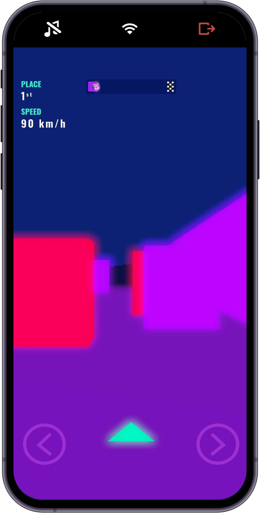

<picture>
<source media="(prefers-color-scheme: dark)" srcset="docs/static/img/readme-hero-dark.png" >
<source media="(prefers-color-scheme: light)" srcset="docs/static/img/readme-hero-light.png" >

</picture>

  <a href="https://developers.rune.ai">Docs</a> · <a href="https://discord.gg/dusk-devs">Discord</a> · <a href="https://developers.rune.ai/faq">FAQ</a> · <a href="https://developers.rune.ai/blog">Blog</a> · <a href="https://developers.rune.ai/docs/examples">Examples</a> 

# Rune

Build a multiplayer game played by millions! Your game runs inside the Rune app with 10 million installs across [iOS](https://apps.apple.com/app/rune-games-and-voice-chat/id1450358364) and [Android](https://play.google.com/store/apps/details?id=ai.rune.tincan). You focus on your game, Rune handles everything else, incl. servers and networking.

You can make your game using JavaScript / TypeScript and your favorite web framework such as React, Svelte, Vue, Threejs, PixiJS, Phaser. The Rune app has friends, messaging, spectating and voice chat built-in to turn your game into an incredible multiplayer experience.

## Features

- **Social**: Rune has messaging and voice chat so players can hang out together and talk about your game.
- **Fast & Reliable**: Our predict-rollback netcode updates clients immediately and the server resolves conflicts.
- **Free**: We pay for servers, voice chat, and everything else. It's 100% free to launch your game on Rune.

## Documentation

- [Quick Start](https://developers.rune.ai/docs/quick-start)
- [Philosophy](https://developers.rune.ai/docs/how-it-works/philosophy)
- [Syncing Game State](https://developers.rune.ai/docs/how-it-works/syncing-game-state)
- [Simulating Multiplayer](https://developers.rune.ai/docs/publishing/simulating-multiplayer)
- [SDK API Reference](https://developers.rune.ai/docs/api-reference)

## Examples

| Tic Tac Toe | Outmatched | Sudoku | Pinpoint |
|---|---|---|---|
|  |  |  |  |
| [Demo](https://developers.rune.ai/examples/tic-tac-toe/), [Source](https://github.com/rune/rune/tree/staging/examples/tic-tac-toe) | [Demo](https://developers.rune.ai/examples/outmatched/), [Source](https://github.com/rune/rune/tree/staging/examples/outmatched) | [Demo](https://developers.rune.ai/examples/sudoku/), [Source](https://github.com/rune/rune/tree/staging/examples/sudoku) | [Demo](https://developers.rune.ai/examples/pinpoint/), [Source](https://github.com/rune/rune/tree/staging/examples/pinpoint) |

| OinkOink | Paddle | Cube Rush | Neon Snake |
|---|---|---|---|
|  |  |  |  |
| [Demo](https://developers.rune.ai/examples/oink-oink/), [Source](https://github.com/rune/rune/tree/staging/examples/oink-oink) | [Demo](https://developers.rune.ai/examples/paddle/), [Source](https://github.com/rune/rune/tree/staging/examples/paddle) | [Demo](https://developers.rune.ai/examples/cube-rush/), [Source](https://github.com/rune/rune/tree/staging/examples/cube-rush) | [Demo](https://developers.rune.ai/examples/neon-snake/), [Source](https://github.com/rune/rune/tree/staging/examples/neon-snake) |

## Packages

- [eslint-plugin-dusk](https://github.com/rune/rune-multiplayer-web-games/tree/staging/packages/eslint-plugin-dusk) – rules and config for writing safe logic code for the Dusk SDK
- [dusk-games-cli](https://github.com/rune/rune-multiplayer-web-games/tree/staging/packages/rune-games-cli) – command line tool to develop and upload your HTML5 game for Dusk
- [vite-plugin-rune](https://github.com/rune/rune-multiplayer-web-games/tree/staging/packages/vite-plugin-dusk) – Vite plugin for writing games for the Dusk SDK

## Community

Have a question or want to discuss with others how to make an amazing multiplayer game? Join our [Discord server](https://discord.gg/dusk-devs)!

## Contributing

We'd really appreciate your help in making Rune as useful as possible for everyone wanting to make a multiplayer game. Don't hesitate to open an issue or PR. If you find Rune interesting, then please star and share the repo. 

<picture>
<source media="(prefers-color-scheme: light)" srcset="docs/static/img/star-the-repo-light.gif" >
<source media="(max-width: 543px)" srcset="docs/static/img/star-the-repo-dark-mobile.gif" >

</picture>

