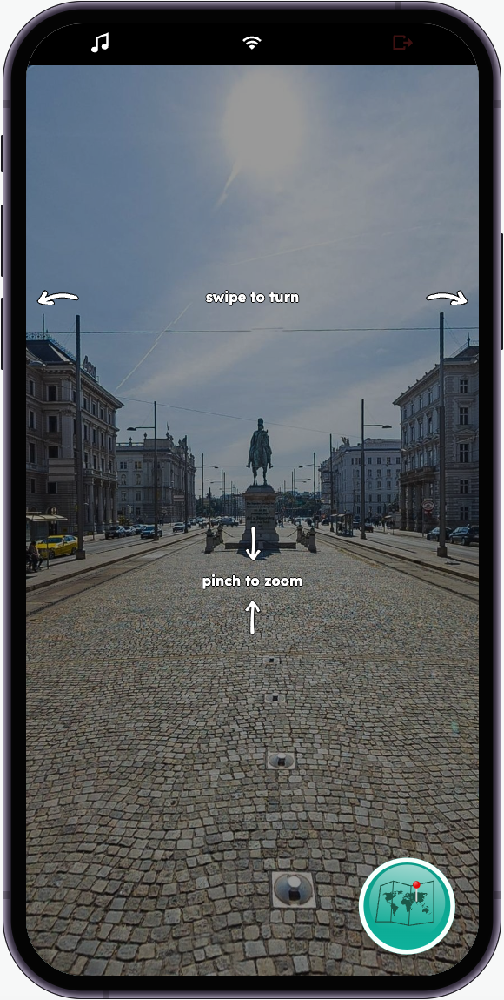

# Pinpoint

A multiplayer game built using the Rune SDK, where you look around a 360° panorama photo and guess where you are in the world. The closer you are, the more points you get. Here's a [demo](https://developers.rune.ai/examples/pinpoint/).

The game uses [openlayers](https://github.com/openlayers/openlayers) for displaying maps and [photo-sphere-viewer](https://github.com/mistic100/Photo-Sphere-Viewer) to for rendering panoramas.

The panorama photos used for this project are not covered by the MIT license. The panorama photos are generously provided by the photographers to be used for free open-source games on the Rune platform only. The photos and their associated copyright belong to the original authors.

[](https://developers.rune.ai/examples/pinpoint/)

## Install

```sh
yarn
```

## Run for development

```sh
yarn dev
```

## Build for upload

```sh
yarn build
```

## Adding more panoramas

After adding more panoramas, make sure to re-build panoramasLogic with:

```sh
yarn generatePanoramasLogic
```
