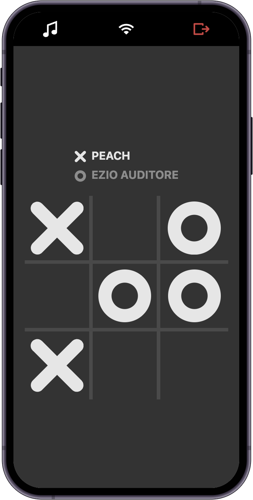

# Tic Tac Toe example

The classic game implemented using the Rune SDK and vanilla JS. Here's a [demo](https://developers.rune.ai/examples/tic-tac-toe/).

[](https://developers.rune.ai/examples/tic-tac-toe/)

## Run for development

```sh
npx serve@latest
```