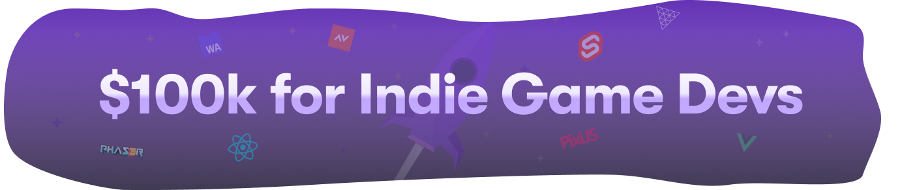

<picture>
<source media="(prefers-color-scheme: dark)" srcset="../docs/static/img/open-source-grant-dark.png" >
<source media="(prefers-color-scheme: light)" srcset="../docs/static/img/open-source-grant-light.png" >

</picture>

# Rune Open-Source Grants

We at [Rune](https://rune.ai) believe that tons of amazing multiplayer games are just waiting to be made by talented indie devs. We've created this $100k grants program to help such indie devs and grow the open-source web game community. Based on us searching GitHub, we've found only [25 open-source multiplayer JS games](./games.md). We hope that these grants will dramatically boost the ecosystem! 

Rune will award two kinds of grants to indie game devs who make an open-source multiplayer web game:

- **Spark** grants of $500 awarded to promising indie game devs (any background welcome)
- **Ignite** grants of $5000 awarded to devs who've proven themselves with a **Spark** grant

With these grants, we want to give indie devs wanting to make a multiplayer game an extra boost. 

### 🌟 Featured Across The Web 

The devs who are awarded the grant will get featured across the web: 

- Post on your specific game on Rune's blog
- Your game highlighted inside the Rune app
- Shoutouts on Twitter, Reddit and LinkedIn

Additionally, you can list that you won a competitive grant on your LinkedIn & GitHub. All of this help boost your path as a game/web dev!

### 🚀 Applying with a Game

Devs can apply for this grant with either an existing game or a new game idea. To be eligible, the final game must be:
- Multiplayer using [Rune](https://developers.rune.ai)
- Open-source code with MIT license
- Written using JavaScript / TypeScript

Your content (art, sounds, etc.) can use any license approved by the Open Source Institute or Creative Commons license. This approach of MIT license for code and flexible license for content allows others to get inspired by your game while giving you flexibility in how you share your game with the open-source community. For instance, you can make all your content non-commercial so only you can publish the game.

Your game remains yours completely. **You retain full rights to your game** and you can **publish your game anywhere you like** besides Rune.

### 🌱 Why is Rune doing this?

We want to support the open-source community and showcase how Rune can help make awesome multiplayer gaming experiences. We think it's a win-win for everyone:
- New exciting multiplayer games on Rune
- Interesting open-source code that others can learn from
- Free money and recognition for talented indie devs

All the game code will be MIT-licensed and serve as inspiration for developers building web games inside and outside Rune’s ecosystem. For instance, many games will use Three.js, PixiJS, React, etc. and become great examples of how to build games using these libraries.

### ⚡️ Application Process

1. **Apply:** Fill out the [application form](https://grant-form.rune.ai/) before the deadline with a new game idea or an existing game
2. **Review:** A panel of experts reviews your application and you hear back from us within 2 weeks after the deadline
3. **Build:** Once approved, you can take all the time you'd like to make your amazing multiplayer game
4. **Upload:** Submit your completed game to Rune, fix any major issues, and release it to the world
5. **Launch:** You receive the grant money through GitHub Sponsors and get promoted across the internet

The deadline for applying for an open-source grant is February 7th. We will open again for another round of grant applications again sometime later in 2024. Stay tuned by giving this repo a star and joining the [Rune Discord](https://discord.gg/rune-devs).

<picture>
<source media="(prefers-color-scheme: light)" srcset="../docs/static/img/star-the-repo-light.gif" >
<source media="(max-width: 543px)" srcset="../docs/static/img/star-the-repo-dark-mobile.gif" >

</picture>

-----

# FAQ

### Applying

#### Why the focus on multiplayer web games?
We believe there's lots of awesome multiplayer games just waiting to be made by talented web devs. So we made this grants program to help support them make games using JS. If you're a traditional game dev looking for a grant, you can take a look at e.g. Epic Megagrant or Unity for Humanity.

#### Are there any existing open-source web multiplayer games?
Yes, [here's a list of such games](./games.md) made using JS, incl. many games made by the Rune team themselves. If you've made a game like this, then definitely add it to the list!

#### Can I apply with multiple games?
Yes, you are welcome to apply with more than one game. Each game will be considered on its own merits.

#### Can I apply if I'm not a professional game or web developer?
Yes, we welcome applications from all backgrounds!

#### Why do you have a deadline for submissions instead of allowing devs to apply whenever?
We want to be able to promise to get back to you quickly after applying. We're a small team and can only do that if we know when people will apply. That's why we process applications in batches. Don't worry though, we'll open for applications again sometime later in 2024.

#### Can teams apply or is this grant only for individual developers?
You're welcome to apply as a team. If that's the case, please designate one team member as the primary contact and only submit one application.

#### Can I apply with a Rune game that I already made?
Yes, you can apply with an existing Rune game. You should make sure to specify in detail in the application form what big improvements you want to make to your game if you get the grant.

#### Can I apply with a WASM web export from Unity, Defold, or another non-JS engine?
The grant program is currently focused on JS-based games to build momentum in this particular ecosystem, thereby making it easier to share code and get inspired by each other.

#### Are there any age or country restrictions?
We think anyone can be an awesome game dev and so the only restrictions are those required by GitHub Sponsors. This means that game devs above the age of 13 can participate as long as GitHub can verify info with your legal guardian.

### Rune

#### What is Rune?
Rune is a [multiplayer gaming platform](https://rune.ai) with 10m+ installs across [iOS](https://apps.apple.com/us/app/rune-games-and-voice-chat/id1450358364) and [Android](https://play.google.com/store/apps/details?id=ai.rune.tincan). Our mission is to help indie game developers make awesome multiplayer games that get into the hands of millions of players.

#### Can I upload my game to other platforms besides Rune?
Absolutely! You have complete freedom to publish your game on other platforms with no restrictions.

#### Will receiving a grant impact my ability to earn money on Rune in the future?
No, receiving a grant does not affect your future earnings on Rune. Our goal is to support your development journey, not limit it.

#### Is Rune a publisher?
No, Rune is not a publisher. We provide a platform and support for game developers, but you retain full control over your game. You're free to do what you want with your game and make any future decisions regarding its development and distribution.

### Grant

#### What criteria will be used to evaluate grant applications?
Applications will be evaluated based on the game's potential for engaging multiplayer gameplay and the feasibility of development. The experts reviewing applications will also take your team's prior experience into account.  

#### Can I start developing my multiplayer web game before I hear back from you?
Yes, and you can also apply with a game you've already made. You should be aware though that you may not be awarded the grant.

#### What is the timeline for game development and release to receive the grant?
We'll let you know if your application is approved. You can develop your game on your own schedule and take as long as you'd like. The grant is awarded through GitHub Sponsors once your game is approved to be launched on the Rune platform w/o any major bugs and your code + content is made available on GitHub.

#### Roughly how will the money be divided between $500 **Spark** grants and $5000 **Ignite** grants? 
This will be decided based on interest from the open-source community. We wanted to have the $500 grants as we think this is a great way to boost the ecosystem. For many aspiring devs, getting the first few $ is an important milestone. That being said, you shouldn't make an open-source game just for the money. 

#### How do I apply for the Ignite grant?
Devs can apply for the **Ignite** grant once they've proven themselves with a **Spark** grant. At that time, they'll receive a form to apply for the **Ignite** grant with info about the criteria and process for that type of grant.

#### Are there any content restrictions or guidelines for the games?
We require that all games adhere to basic content guidelines such as avoiding hate speech, pornography, and other potentially offensive content. We seek to promote games that are inclusive and accessible to a wide audience.

#### I have questions about the grant program, where do I ask?

We'd love to answer any questions. Please write your question in the **#general** channel in our [Discord server](https://discord.gg/rune-devs).

